### Hi there 👋

#### Personal knowledge base: [`notes.andstuff.dev`](https://notes.andstuff.dev)

#### Top projects

- {{repo 'scrapy-seleniumbase-cdp'}}
- {{repo 'autoscout24-trends'}}
- {{repo 'dependabot-vuln-viewer'}}
- {{repo 'kraken-api-java'}}
- {{repo 'crypto-tools'}}
- {{repo 'yield-borg'}}

#### Contributions

- [LeMyst/jmxterm](https://github.com/LeMyst/jmxterm) *(active fork)*
- [jiaqi/jmxterm](https://github.com/jiaqi/jmxterm)

#### Misc

- {{repo 'HTMLWithImagesToPDF'}}
- {{repo 'opaque-impl'}}
- [**`so3-support-graphique`**](https://gitlab.com/nyg/so3-support-graphique) — *My Bachelor project consisted of adding GUI support for the school's own operating system ([SO3](smartobjectoriented/so3)) using [LVGL](lvgl/lvgl). The project is hosted [here](https://nyg.gitlab.io/so3-support-graphique/index.html).*
- {{srht owner='nyg' name='maven-basics' description='Maven from scratch.'}}
- {{srht owner='nyg' name='sh' description='My very own post-install scripts and dot files, please don\'t use them.'}}

#### Dictionary

- {{repo 'wiktionary-to-kindle'}}
- {{repo 'wiktionarize'}}
- {{repo 'epub-dictionary'}}

#### Code examples

- {{srht owner='nyg' name='example-java-jca' description='Some code example with the Java Cryptography Architecture API, and an attempt at writing a pure-JCA (i.e. Provider-indenpendent) ECDSA and EdDSA signature verification class.'}}
- {{srht owner='nyg' name='example-java-jmx' description='Some tests with Java\'s JMX API.'}}
- {{srht owner='nyg' name='example-java-spring-batch-bug' description='Showcasing a currently opened bug ([#4427](spring-projects/spring-batch/issues/4427)) in Spring Batch with the Oracle database when using `List<>` as a parameter.'}}
- {{srht owner='nyg' name='example-java-carnotzet' description='A simple app using Swissquote\'s [Carnotzet](swissquote/carnotzet) framework.'}}
- {{srht owner='nyg' name='example-java-querydsl' description='An attempt at defining JPA entities in one Maven module and importing this module in another, and generating QueryDSL\'s query type classes from there (works with Java EE but not Jakarta).'}}
- {{srht owner='nyg' name='example-java-cli-app' description='An example app that uses the [Apache Commons CLI library](https://commons.apache.org/proper/commons-cli).'}}
- {{srht owner='nyg' name='example-js-cli-app' description='A simple Node.js command-line app example using ESM.'}}
- {{repo 'ncc-pkg-examples'}}

#### Swift gists

- {{gist 'AddJPEGComment.swift'}}
- {{gist 'EXIFUserComment.swift'}}
- {{gist 'MemoryAddress.swift'}}
- {{gist 'iOSCreatePDF.swift'}}
- {{gist 'Uptime.swift'}}

#### Misc gists

- {{gist 'uptime.c'}}
- {{gist 'pdk.c'}}
- {{gist 'AllJCAServices.java'}}
- {{gist 'fk_generate_delete.sql'}}
- {{gist 'fk_delete_recursive.sql'}}

### Dynamic statistics

#### Most starred repositories

| Description |  |  | 
| :--- | ---: | ---: | ---: |
{{#list repositories sortBy='stargazerCount' direction='desc' top=3}}
| [{{description}}]({{url}}) | {{stargazerCount}} | {{forkCount}} | {{issues.totalCount}}
{{/list}}

#### Most starred gists

| Description |  |  | 
| :--- | ---: | ---: | ---: |
{{#list gists sortBy='stargazerCount' direction='desc' top=3}}
| [{{description}}]({{url}}) | {{stargazerCount}} | {{forks.totalCount}} | {{comments.totalCount}}
{{/list}}

#### Cards (by *[readme-tools/github-readme-stats](https://github.com/readme-tools/github-readme-stats)*)

  
  

