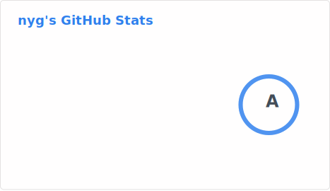
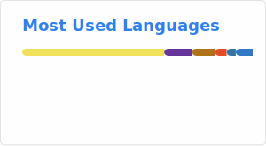

### Hi there 👋

#### Personal knowledge base: [`notes.andstuff.dev`](https://notes.andstuff.dev)

#### Top projects

- {{repo 'jmxsh'}}
- {{repo 'scrapy-seleniumbase-cdp'}}
- {{repo 'mkv-cleaner'}}
- {{repo 'autoscout24-trends'}}
- {{repo 'dependabot-vuln-viewer'}}
- {{repo 'kraken-api-java'}}
- {{repo 'crypto-tools'}}
- {{repo 'qoqa-compta'}}

#### Contributions

<table>
  <tr>
    <th align="left">Repository</th>
    <th align="right">Pull requests</th>
  </tr>
  {{#filterout pullRequests 'repo.owner.login' (array 'panticne' 'gs-2019' 'SoftEng-HEIGVD' 'Quartz-Core')}}
  {{#list this sortBy='prCount' direction='desc'}}
  <tr>
    <td><a href="{{url}}">{{repo.nameWithOwner}}</a></td>
    <td align="right">{{#each prs}}<a href="{{url}}" title="{{title}}">#{{number}}</a> {{/each}}</td>
  </tr>
  {{/list}}
  {{/filterout}}
</table>

#### Most starred repositories

<table>
  <tr>
    <th align="left">Description</th>
    <th align="right"></th>
    <th align="right"></th>
    <th align="right"></th>
  </tr>
  {{#list repositories sortBy='stargazerCount' direction='desc' top=3}}
  <tr>
    <td><a href="{{url}}">{{description}}</a></td>
    <td align="right">{{stargazerCount}}</td>
    <td align="right">{{forkCount}}</td>
    <td align="right">{{issues.totalCount}}</td>
  </tr>
  {{/list}}
</table>

#### Most starred gists

<table>
  <tr>
    <th align="left">Description</th>
    <th align="right"></th>
    <th align="right"></th>
    <th align="right"></th>
  </tr>
  {{#list gists sortBy='stargazerCount' direction='desc' top=3}}
  <tr>
    <td><a href="{{url}}">{{description}}</a></td>
    <td align="right">{{stargazerCount}}</td>
    <td align="right">{{forks.totalCount}}</td>
    <td align="right">{{comments.totalCount}}</td>
  </tr>
  {{/list}}
</table>

#### Dictionary

- {{repo 'wiktionary-to-kindle'}}
- {{repo 'wiktionarize'}}
- {{repo 'epub-dictionary'}}
- {{repo 'greek-dictionaries'}}
- {{repo 'tab2opf'}}

#### iOS & Swift

- {{repo 'HTMLWithImagesToPDF'}}
- {{repo 'iOSSystemSoundsLibrary'}}
- {{repo 'DateCellSwift'}}
- {{gist 'iOSCreatePDF.swift'}}
- {{gist 'MemoryAddress.swift'}}
- {{gist 'EXIFUserComment.swift'}}
- {{gist 'AddJPEGComment.swift'}}
- {{gist 'Uptime.swift'}}
- {{gist 'Serialize.swift'}}
- {{gist 'UIApplicationDelegate.swift'}}
- {{gist 'sequence_iterator.swift'}}

#### Java & JMX

- {{repo 'homebrew-jmxsh'}}
- {{gist 'AllJCAServices.java'}}
- {{gist 'FreeSwap.java'}}
- {{gist 'AsynchronousServerSocketChannelTest.java'}}

#### Crypto & Finance

- {{repo 'kraken-ticker'}}
- {{repo 'smart-contracts'}}
- {{repo 'opaque-impl'}}
- {{repo 'vagrant-bitcoin-node'}}
- {{gist 'kraken-ledger.js'}}

#### Tools & Projects

- {{repo 'pagerduty'}}
- {{repo 'h2-recover'}}

#### Code examples

- {{srht owner='nyg' name='example-java-jca' description='Some code example with the Java Cryptography Architecture API, and an attempt at writing a pure-JCA (i.e. Provider-indenpendent) ECDSA and EdDSA signature verification class.'}}
- {{srht owner='nyg' name='example-java-jmx' description='Some tests with Java\'s JMX API.'}}
- {{srht owner='nyg' name='example-java-spring-batch-bug' description='Showcasing a currently opened bug ([#4427](spring-projects/spring-batch/issues/4427)) in Spring Batch with the Oracle database when using `List<>` as a parameter.'}}
- {{srht owner='nyg' name='example-java-carnotzet' description='A simple app using Swissquote\'s [Carnotzet](swissquote/carnotzet) framework.'}}
- {{srht owner='nyg' name='example-java-querydsl' description='An attempt at defining JPA entities in one Maven module and importing this module in another, and generating QueryDSL\'s query type classes from there (works with Java EE but not Jakarta).'}}
- {{srht owner='nyg' name='example-java-cli-app' description='An example app that uses the [Apache Commons CLI library](https://commons.apache.org/proper/commons-cli).'}}
- {{srht owner='nyg' name='example-js-cli-app' description='A simple Node.js command-line app example using ESM.'}}
- {{srht owner='nyg' name='maven-basics' description='Maven from scratch.'}}
- {{repo 'ncc-pkg-examples'}}

#### Misc

- {{srht owner='nyg' name='sh' description='My very own post-install scripts and dot files, please don\'t use them.'}}
- {{repo 'heig-vd'}}
- {{repo 'greek-election-data'}}
- {{repo 'renovate-presets'}}
- {{gist 'uptime.c'}}
- {{gist 'pdk.c'}}
- {{gist 'div_euc_hex.c'}}
- {{gist 'auto_extract.sh'}}
- {{gist 'use-local-storage.js'}}
- {{gist 'request.mjs'}}
- {{gist 'yql_json.html'}}
- {{gist 'enlarge_image.php'}}
- {{gist 'fk_generate_delete.sql'}}
- {{gist 'fk_delete_recursive.sql'}}

### Statistics

#### Cards (by *[readme-tools/github-readme-stats](https://github.com/readme-tools/github-readme-stats)*)

  
  

